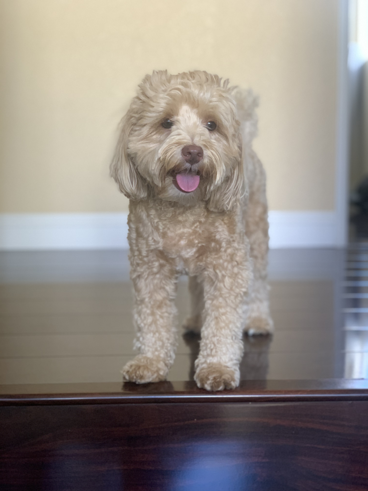

# Mihir Gupta's User Page


Here's my dog!



## Table of Contents
[About Me](#about-me)\
[Professional Experience](#professional-experience)\
[What I do for fun](#what-i-do-for-fun)\
[My favorite things](#my-favorite-things)\
[My future plans](#my-future-plans)


## About Me

I attend the **University of California, San Diego** and am currently in my third-year of pursuing a computer science degree. Specifically, I am pursuing a *Bachelor's in Science* (B.S.).

One of my favorite quotes is from the astronomer Carl Sagan:
> Somewhere, something incredible is waiting to be known.

## Professional Experience

Regarding my professional experience, I have experience with various mobile development and web development frameworks. If you want to see the work I have done on the UCSD-Mobile project locally, you can execute the following command in the terminal to check it out from GitHub:

```
git clone https://github.com/UCSD/campus-mobile.git
```

The repository can be found [here](https://github.com/UCSD/campus-mobile.git).


## What I do for fun

I love to travel and visit new places. You can see some pictures from my recent trip to Hawaii: [Sunset](assets/hawaii/IMG_9423.jpg), [Beach](http://mihirgupta.dev/cse110-lab1/assets/hawaii/IMG_9362.jpg).

## My favorite things

I enjoy listening to music. These are my favorite genres:

1. R&B
2. Hip Hop
3. Pop
   
I also watch a lot of television shows. These are among my latest favorites:

- The Mandalorian
- The Expanse
- Ted Lasso
- Wandavision

## My future plans

I have a list of future plans that I want to accomplish. 

- [X] Go to college for Computer Science
- [X] Get an internship
- [ ] Go to grad school
- [ ] Become a software engineer!


